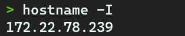
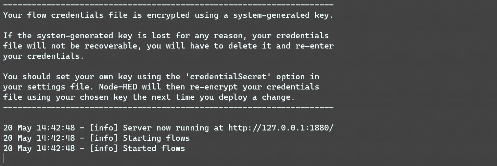
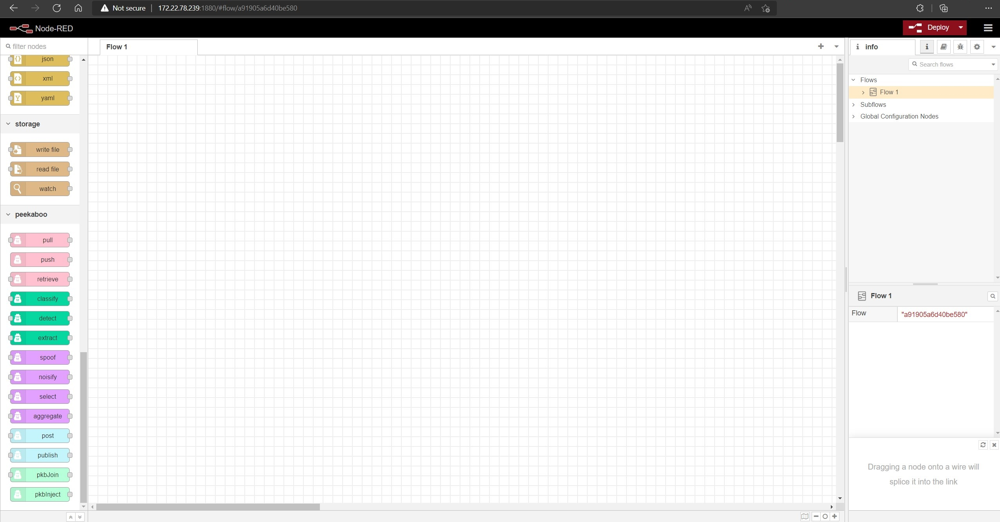

# Installation

1. Install ubuntu OS on the Raspberry Pi. Suggest [ubuntu server 18.04 server](https://ubuntu.com/download/raspberry-pi/thank-you?version=18.04.5&architecture=arm64+raspi4).

2. Install Node.js and npm with the following commands:
```bash
sudo apt update
sudo apt install nodejs npm
``` 

3. Install [Node-RED](https://nodered.org/) globally with the following command:
```bash
npm i - g node-red
```

4. Clone this repository locally and install the Peekaboo operators using our provided installation script:
```bash
git clone https://github.com/CMUChimpsLab/Peekaboo.git
cd Peekaboo/peekaboo-operators
bash reinstall_allnodes.sh
```

5. Use the following command to find your Raspberry Pi's IP address:
```bash
hostname -I
```


6. Start the server using the `node-red` command


7. You can then connect to the server on your local computer browser by typing the IP address we found earlier, with `:1880` at the end:
