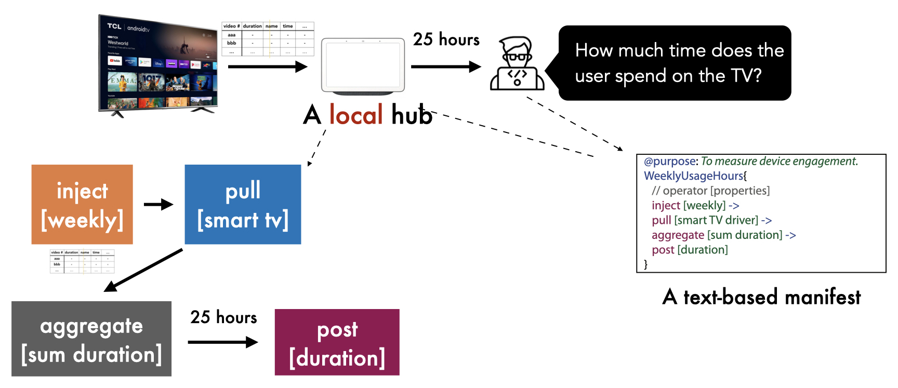

# Peekaboo

Peekaboo, a new privacy-sensitive
architecture for developers to build smart home apps. Peekaboo has three key ideas: manifest, operators, and runtime (hub).

- First, app developers must declare all intended data collection behaviors in a text-based ***manifest***, including under what conditions data will be sent outside of the home to cloud services, where that data is being sent to, and the granularity of the data itself. 
- Second, to specify these behaviors, developers choose from a small and fixed set
of ***operators*** with well-defined semantics, authoring a streamoriented pipeline similar to Unix pipes. This pipeline preprocesses raw data from IoT devices in the home (e.g. sensor data or usage history) into the granularity needed by the cloud service. 
- Third, an ***in-home trusted Peekaboo hub*** mediates between all devices in the home and the outside Internet. This hub enforces the declared behaviors in the manifests, and also locally runs all of the operators specified in these manifests to transform raw data before it is relayed to any cloud services.

Combined, these ideas make it so that developers can reduce data collection by running pre-processing tasks on the in-home trusted hub, and users and third-party auditors can inspect data behaviors by analyzing these manifests as well as any actual data flows. 

Our approach also facilitates a number of privacy features that can be supported by the hub itself, such as adding additional conditions or transformations before data flows out, or transforming parts of the manifest into natural language statements to make it easier for lay people to understand what data will be sent out, when, and to where.

For details, see our IEEE S&amp;P 2022 paper: [Peekaboo: A Hub-Based Approach to Enable Transparency in Data Processing within Smart Homes](http://haojianj.in/resource/pdf/peekaboo-oakland22.pdf)

## System Requirements

To run Peekaboo, we suggest you use a dedicated RaspberryPi. You can also test the system on a laptop, but a few machine learning libraries will not work since they are compiled on ARM architecture. 

Our setup: 

1. Raspberry Pi 4 Model B (>4 GB memory).
2. [Google Coral USB Accelerator](https://coral.ai/products/accelerator/)

## Installation & Contributing

Follow the directions in [INSTALL.md](https://github.com/CMUChimpsLab/Peekaboo/blob/main/INSTALL.md) to install Peekaboo on your own hardware.  

Follow the instructions in [DEVELOP.md](https://github.com/CMUChimpsLab/Peekaboo/blob/main/DEVELOP.md) to contirbute new operators/functionalities to enhance Peekaboo. 

## WEB Manifest IDE UI

## Funding
This research was supported in part by the National Science Foundation under Grant No. CNS-1801472, CNS-1837607, and CNS-2007786, Cisco, Intel, Infineon, and Air Force
Research Laboratory under agreement number FA8750-15-2-0281. 