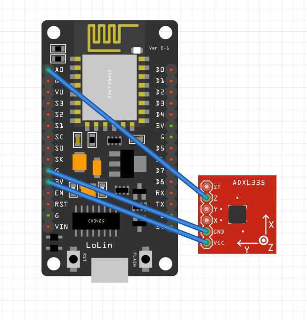

# WiFi MQTT Accelerometer

## Parts

- NodeMCU ESP8266 / Espressif ESP32
- XL335B on GY-61 breakout board (3-axis accelerometer)

## Schematic

## Configuration
See [Configuring Board](../README.md#Configuration)

## Power consumption
5V, 20mA = 0.1W
