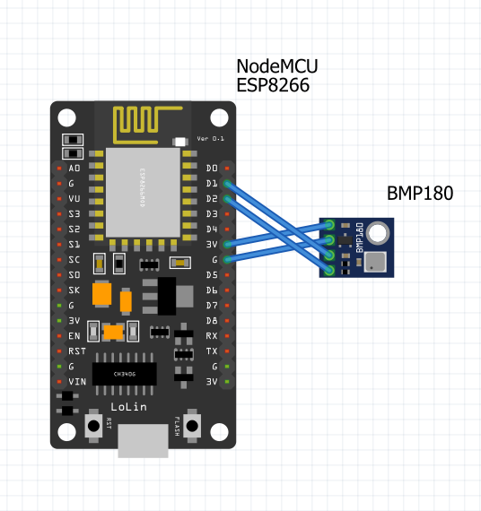

# WiFi MQTT Temperature Sensor

## Parts
- NodeMCU ESP8266 / Espressif ESP32
- BMP180 (air temperature and pressure sensor)

## Schematic

## Configuration
See [Configuring Board](../README.md#Configuration)

## Power consumption
5V, 20mA = 0.1W