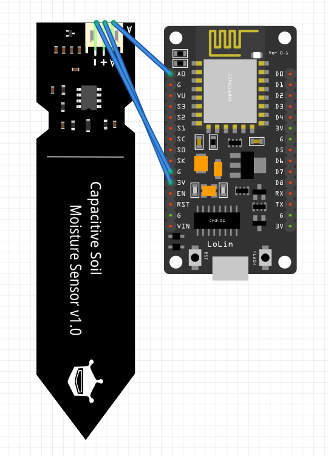

# WiFi MQTT Soil Moisture Sensor

## Parts
- NodeMCU ESP8266 / Espressif ESP32
- Capacitive Soil Moisture Sensor (water temperature sensor)

## Schematic

## Configuration
See [Configuring Board](../README.md#Configuration)